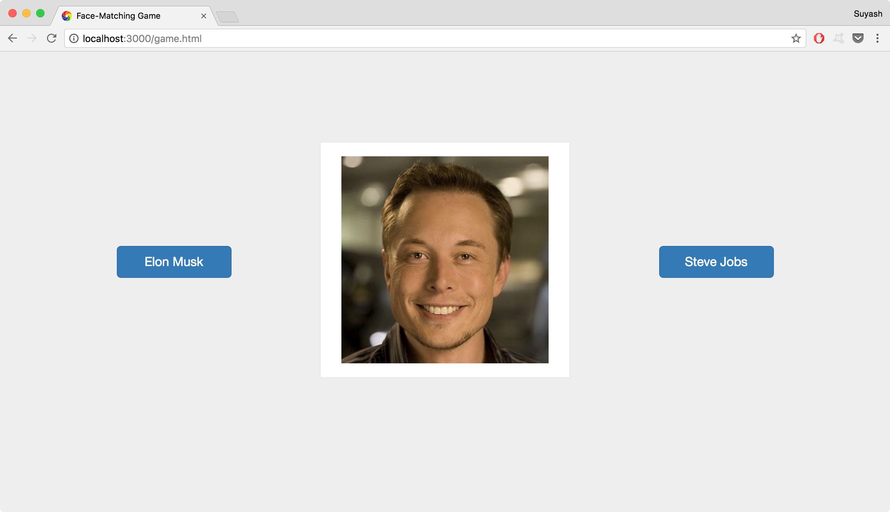
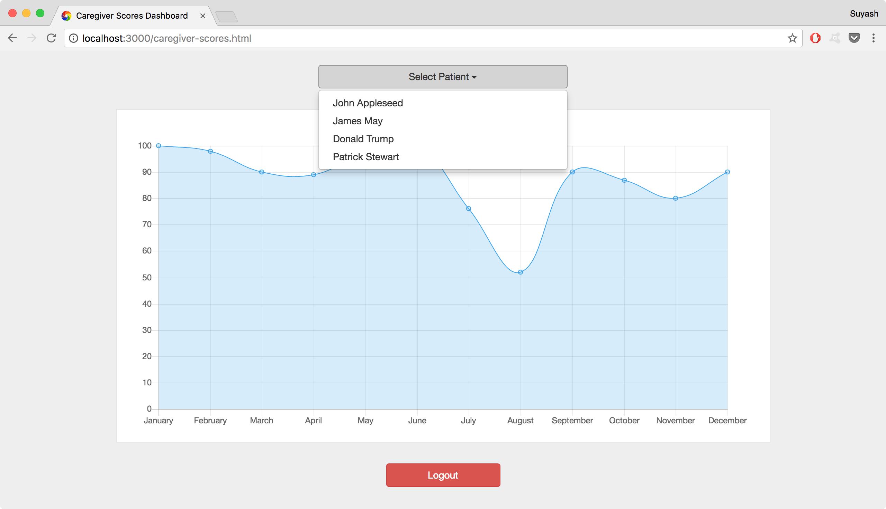

# FaceNameMatchingGame
<i>This project was submitted as part of an assignment to the course CZ3002 - Advanced Software Engineering at Nanyang Technological University and is no longer maintained</i>

This repository contains a webapp for a simple face name matching game for dementia patients. The app uses node.js at the backend with the express framework and EJS as the rendering engine. The pure front end interface of the game can be found [here](https://github.com/SuyashLakhotia/CZ3002-FrontEnd). The patient is shown a picture of a famous personality and given two names to choose from. The game allows a caretaker to view the patient scores in a graphical format.

## Screenshots
#### Face Name Game


#### Patient Scores


## Installations
1. Install [node.js](https://nodejs.org/en/)
2. Install [mongodb](https://www.mongodb.com/)
3. Optionally install [robomongo](http://robomongo.org/)
4. Install the dependencies using ```npm install```

## Running the server
1. If running for the first time, uncomment line number 38 ```require('./app/populateDB.js')();``` in index.js.
2. Run the server with ```node index.js```.
3. Launch the website on your browser at http://localhost:3000.
3. To log in to the patient menu, use email as ```jamesmay@gmail.com``` and password as ```jamesmay```.
4. To log in to the caregiver menu, use email as ```jeremyclarkson@gmail.com``` and password as ```jeremyclarkson```.

## Contributors
1. [nikv96](https://github.com/nikv96)
2. [SuyashLakhotia](https://github.com/SuyashLakhotia)
3. [liuhahi](https://github.com/liuhahi)
